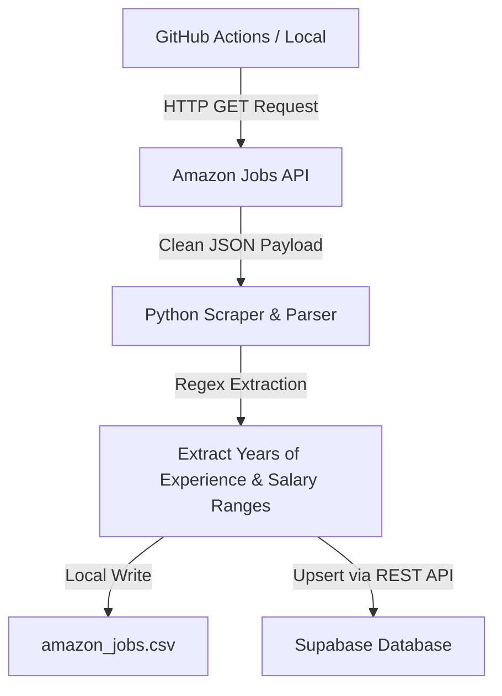

# ManyDataCenter - Jobs Pipeline

An automated data pipeline that fetches "Data Center" jobs from the Amazon Jobs API, extracts key structured fields using regular expressions, saves the data locally, and upserts it to a Supabase database.

---

## Architecture Overview



1. **Extraction**: Targets Amazon's internal JSON endpoint directly, avoiding fragile HTML parsing. Paginated in batches of 100 with automatic offset tracking.
2. **Regex Parsing**:
   - **Qualifications**: Extracts years of experience (both single numbers and ranges like `3-5 years`).
   - **Descriptions**: Extracts salary bands (min/max bounds) and classifies them as `annual` or `hourly`.
3. **Storage**:
   - Updates a local CSV file: `data-center-jobs/amazon_jobs.csv`.
   - Upserts records into a Supabase database matching on the unique `job_id`.

---

## Local Setup

### 1. Install Dependencies
Make sure you have Python 3.11+ installed. Run:
```bash
pip install -r requirements.txt
```

### 2. Configure Environment (Optional for Supabase upload)
To upload data to Supabase locally, set the following environment variables:
```bash
# On Windows (PowerShell)
$env:SUPABASE_URL="https://your-project.supabase.co"
$env:SUPABASE_KEY="your-supabase-service-role-key"

# On Linux/macOS
export SUPABASE_URL="https://your-project.supabase.co"
export SUPABASE_KEY="your-supabase-service-role-key"
```
*If these variables are not set, the script will skip the upload step and save the output locally.*

### 3. Run the Scraper
```bash
python data-center-jobs/amazon_fetch.py
```
This saves the output file to `data-center-jobs/amazon_jobs.csv`.

---

## Supabase Database Setup

To set up the table in Supabase, execute this SQL script in the **SQL Editor** of your Supabase dashboard:

```sql
-- Create the amazon_jobs table
create table if not exists public.amazon_jobs (
    job_id text primary key,
    title text,
    location text,
    basic_qualifications text,
    description text,
    min_years_experience integer,
    max_years_experience integer,
    years_experience_all integer[],
    min_salary numeric,
    max_salary numeric,
    salary_type text,
    fetched_at timestamp with time zone default timezone('utc'::text, now()) not null
);

-- Enable Row Level Security (RLS)
alter table public.amazon_jobs enable row level security;

-- Allow public read access (for dashboards or external access)
create policy "Allow public read access"
on public.amazon_jobs
for select
to public
using (true);
```

---

## GitHub Actions Automated Runner

This pipeline runs automatically daily at midnight UTC using the workflow in `.github/workflows/scrape.yml`.

### Configuration Steps:
1. **Enable Write Permissions**:
   - Go to your repository on GitHub.
   - Go to **Settings** -> **Actions** -> **General**.
   - Under **Workflow permissions**, select **Read and write permissions** and click **Save**.
2. **Add Repository Secrets**:
   - Go to **Settings** -> **Secrets and variables** -> **Actions**.
   - Create two secrets:
     - `SUPABASE_URL`: Your Supabase API endpoint.
     - `SUPABASE_KEY`: Your Supabase **`service_role` key** (needed to bypass RLS and insert/update listings).
